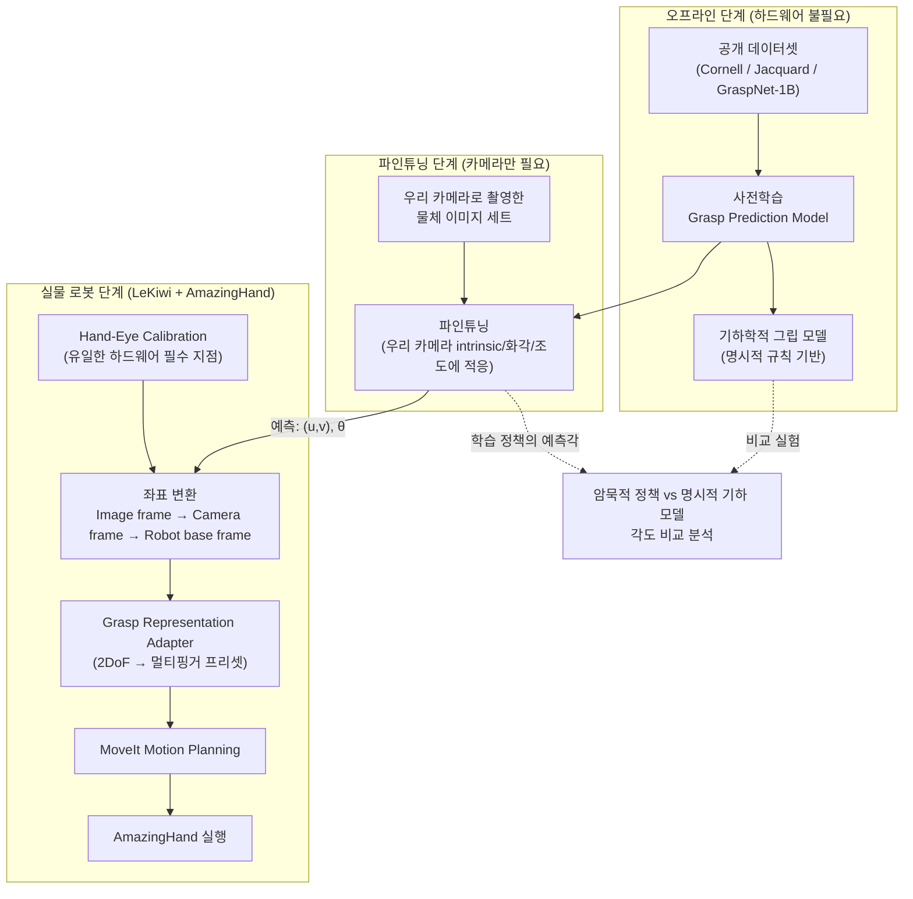
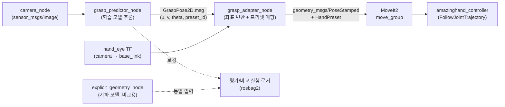

# 그립 각도 자동 탐색 (Automatic Grip Pose Search)

카메라 이미지만으로 "어느 위치를, 어느 회전각으로 접근해야 안정적으로 잡히는가"를 예측하는 모델을 학습시키고,
이를 실제 로봇(LeKiwi + AmazingHand)의 그립 파이프라인에 통합하는 연구.

이 문서는 전체 시스템 구조와 단계별 실행 계획을 정리한다. 핵심 설계 원칙은 하나다:

> **하드웨어 의존점을 최대한 뒤로 미룬다.**
> 이 연구에서 실물 로봇이 반드시 필요한 지점은 **hand-eye calibration** 단 한 곳뿐이다.
> 나머지(사전학습, 파인튜닝용 카메라 데이터 수집, 기하 모델 설계, 비교 실험 설계)는
> 하드웨어 대기 없이 지금 바로 시작할 수 있다.

---

## 1. 연구 배경 요약

| 항목 | 내용 |
|---|---|
| 평행 그리퍼 그립 예측 | 성숙한 분야 (Cornell Grasp, Jacquard, GraspNet-1B 등 벤치마크·베이스라인 다수) |
| 멀티핑거 핸드(AmazingHand) 그립 예측 | 미성숙 — 자유도가 늘어나 표현/탐색 공간이 훨씬 큼 |
| 저가형 하드웨어 기준 연구 사례 | 확인되지 않음 (차별점) |
| 단안 카메라(깊이 센서 無) 그립 예측 | 최근 연구 흐름과 일치 (RGB-only grasp affordance 예측) |
| LeKiwi + 핸드 결합 연구 | 확인되지 않음 (차별점) |

즉 이 연구는 "단안 카메라 기반 그립 예측"이라는 성숙해가는 방법론을,
"저가형 멀티핑거 핸드 + 모바일 베이스(LeKiwi)"라는 아직 검증되지 않은 조합에 적용하는 것이 핵심 기여다.

---

## 2. 전체 시스템 아키텍처



**단계 구분의 의미**

- **오프라인 단계**: 실물 로봇 없이 GPU만 있으면 진행. 지금 바로 착수 가능.
- **파인튜닝 단계**: 로봇 팔 동작 없이 카메라만 있으면 진행 가능 (물체를 손으로 배치하고 촬영, 또는 teleoperation으로 수집).
- **실물 로봇 단계**: hand-eye calibration이 끝나야 좌표 변환이 의미를 가지므로, 이 시점부터 실제 파지 실행이 가능해짐.

---

## 3. 단계별 실행 계획

### Phase 0 — 사전학습 (Pretraining)
- **입력**: 공개 그립 데이터셋 (RGB 이미지 + 그립 사각형/포인트 라벨)
- **후보 데이터셋**
  - Cornell Grasp Dataset — 소규모, 진입 난이도 낮음, baseline 검증용
  - Jacquard Dataset — 시뮬레이션 대규모, 다양한 물체
  - GraspNet-1Billion — RGB-D, 최신 벤치마크 (깊이 없이 RGB만 사용하는 서브셋으로 활용 가능)
- **출력 표현 (평행 그리퍼 기준, 2DoF)**: `(u, v, θ)` — 이미지 좌표계에서의 중심 위치 + 회전각
- **모델 후보**: GG-CNN 계열(경량, 실시간성 우수) 또는 ResNet/ViT backbone + heatmap regression head
- **산출물**: 사전학습된 가중치, 학습/검증 파이프라인 코드, 재현 가능한 config

### Phase 1 — 파인튜닝 (Domain Adaptation)
- **목적**: 사전학습 도메인(공개 데이터셋 카메라)과 우리 카메라(화각, 해상도, 왜곡, 조도 환경)의 차이 보정
- **데이터 수집**: 우리 카메라로 실제 사용할 물체들을 다양한 각도/거리/조명에서 촬영 (로봇 팔 미동작 상태로도 가능)
- **라벨링 전략**:
  - 소량 수동 라벨링 + 사전학습 모델로 pseudo-label 생성 후 검수 (반자동)
  - 또는 시뮬레이터에서 우리 카메라 intrinsic을 반영한 synthetic fine-tuning set 생성
- **검증 지표**: 사전학습 모델 대비 예측 그립 사각형의 IoU/각도 오차 개선폭

### Phase 2 — Hand-Eye Calibration (유일한 실물 의존 지점)
- **목적**: 카메라 좌표계에서 예측된 `(u, v, θ)` → 카메라 3D 좌표 → 로봇 base 좌표계로 변환하는 변환 행렬 확보
- **방식**: eye-in-hand 또는 eye-to-hand 중 카메라 장착 위치에 맞게 선택 (LeKiwi 구조 확인 필요)
- **도구**: ArUco/Charuco 마커 + MoveIt/TF 기반 calibration 루틴, 또는 `easy_handeye` (ROS) 계열 패키지 활용
- **산출물**: `camera_optical_frame → base_link` 정적 TF, 재보정 스크립트 (진동/재조립 시 재사용)

### Phase 3 — Grasp Representation Adapter (2DoF → AmazingHand)
평행 그리퍼의 2DoF(중심 위치 + 회전각) 표현을 그대로 멀티핑거 핸드에 쓸 수 없다. 손가락 개수만큼 자유도가 늘어나기 때문에, **초기 버전은 단순화 전략을 명시적으로 채택**한다.

- **1단계 (권장 시작점)**: 손가락 배치를 몇 가지 프리셋으로 고정
  - 예: `PINCH`(2지 파지), `TRIPOD`(3지 파지), `WRAP`(전체 감싸기) 등 프리셋 3~5개
  - 모델은 여전히 접근 위치 `(u,v)`와 회전각 `θ`만 예측
  - 프리셋 선택은 규칙 기반(물체 크기/종횡비 추정) 또는 별도의 경량 분류기로 결정
- **2단계 (확장)**: 프리셋 선택 자체도 학습 대상으로 포함 (예측 = 위치 + 각도 + 프리셋 클래스)
- **3단계 (장기)**: 손가락별 관절각까지 직접 회귀하는 완전한 grasp representation으로 확장

이 단계적 접근은 "핸드 그립은 미성숙 분야"라는 연구 배경과 직결된다 — 처음부터 전체 자유도를 학습시키기보다,
평행 그리퍼에서 검증된 2DoF 표현을 최대한 재사용하며 점진적으로 확장하는 것이 리스크를 줄인다.

### Phase 4 — 명시적 기하 모델 (비교군)
- 학습 기반 모델과 별개로, 물체의 point cloud/contour로부터 그립 각도를 **규칙 기반으로 계산**하는 기하 모델을 구현
- 예: 주축(principal axis) 정렬, 최소 폭 방향 탐색, antipodal grasp 조건 검사 등
- 목적: "학습된 정책이 암묵적으로 찾아낸 각도"와 "기하학적으로 계산된 각도"를 정량 비교하는 실험의 기준선(baseline) 확보

### Phase 5 — 비교 실험
- **비교 대상**: (a) 학습 기반 예측 각도, (b) 기하 모델 계산 각도
- **비교 지표**:
  - 각도 차이 (°) 분포
  - 각 방식의 실제 파지 성공률 (실물 로봇 필요)
  - 물체 형상 복잡도에 따른 두 방식의 편차 상관관계 (단순 형상일수록 기하 모델과 일치할 것이라는 가설 검증)
- **의의**: 학습 모델이 실제로 "형상 기반의 합리적인 grasp"를 학습했는지 해석 가능성(interpretability) 관점에서 검증

---

## 4. ROS2 파이프라인 설계 (통합 시점)

실물 로봇 통합 시 다음과 같은 노드 구성을 제안한다. (지금 단계에서는 설계만 해두고,
Phase 0~1은 이 그래프 밖에서 독립적으로 개발 가능)



- **커스텀 메시지 제안**: `GraspPose2D.msg` (`float32 u, float32 v, float32 theta, string preset_id, float32 confidence`)
- **grasp_adapter_node**: 이미지 좌표 → 카메라 좌표(핀홀 모델 역투영, 필요시 깊이 추정) → TF로 base_link 변환 → MoveIt 목표 pose 생성
- **rosbag2 로깅**: Phase 5 비교 실험을 위해 추론 결과/기하 모델 결과/실제 실행 결과를 항상 기록해두는 것을 권장

---

## 5. 제안 리포지토리 구조

```
first-repository/
├── docs/
│   └── grip-angle-auto-search.md        # 본 문서
├── grasp_model/                          # Phase 0~1: 모델 학습 (ROS 비의존)
│   ├── datasets/                         # Cornell/Jacquard 로더, 우리 카메라 데이터 로더
│   ├── models/                           # backbone + grasp head 정의
│   ├── train_pretrain.py
│   ├── train_finetune.py
│   └── configs/
├── geometry_baseline/                    # Phase 4: 명시적 기하 모델 (ROS 비의존)
│   └── explicit_grasp_geometry.py
├── ros2_ws/src/
│   ├── grasp_msgs/                       # GraspPose2D.msg 등 커스텀 메시지
│   ├── grasp_predictor_node/             # Phase 4 연동: 학습 모델 추론 노드
│   ├── grasp_adapter_node/               # Phase 3: 좌표 변환 + 프리셋 매핑
│   ├── hand_eye_calibration/             # Phase 2: calibration 루틴 + TF publisher
│   └── amazinghand_bringup/              # 실행/드라이버 launch 파일
└── experiments/
    └── compare_implicit_vs_explicit/     # Phase 5: 비교 실험 스크립트/결과
```

---

## 6. 로드맵 (하드웨어 의존성 명시)

| 단계 | 필요 자원 | 착수 가능 시점 |
|---|---|---|
| Phase 0 사전학습 | GPU, 공개 데이터셋 | **즉시** |
| Phase 4 기하 모델 설계 | 없음 (알고리즘 설계) | **즉시** |
| Phase 1 파인튜닝 데이터 수집 | 카메라 (로봇 팔 불필요) | **즉시** |
| Phase 1 파인튜닝 학습 | GPU, 위 데이터 | Phase 0 완료 후 |
| Phase 2 Hand-eye calibration | LeKiwi + 카메라 (실물) | **하드웨어 도착 후** |
| Phase 3 Grasp adapter 구현 | AmazingHand 사양 문서 | 하드웨어 도착 전 설계 가능, 실측 검증은 도착 후 |
| ROS2 통합 (Phase 2~4 연결) | 실물 로봇 풀세트 | 하드웨어 도착 후 |
| Phase 5 비교 실험 | 실물 로봇, Phase 0/1/4 산출물 | 통합 완료 후 |

**결론**: 지금 시점에서 즉시 시작 가능한 작업은 Phase 0(사전학습), Phase 1의 데이터 수집, Phase 4(기하 모델 설계) 세 가지다.
하드웨어가 도착하는 시점에는 모델과 기하 baseline이 이미 준비되어 있어야 하며,
그 시점부터는 Phase 2(hand-eye calibration) → Phase 3(adapter) → ROS2 통합 → Phase 5(비교 실험) 순으로 빠르게 진행하는 것이 목표다.

---

## 7. 다음 학습 포인트 (ROS2/MoveIt 성장 관점)

이 프로젝트를 진행하면서 익혀두면 좋은 개념들을 실행 순서에 맞춰 정리한다.

1. **TF2**: `camera_optical_frame`, `base_link`, `end_effector` 간의 좌표 변환 개념과 `tf2_ros` 사용법 — hand-eye calibration 이해의 전제
2. **hand-eye calibration 수학**: `AX = XB` 문제의 의미, eye-in-hand vs eye-to-hand 차이
3. **MoveIt2 motion planning**: `PoseStamped` 목표를 받아 충돌 없는 경로를 생성하는 과정, 그리고 그리퍼 대신 커스텀 핸드를 MoveIt에 등록하는 방법(URDF/SRDF, end-effector group 정의)
4. **ROS2 커스텀 메시지/노드 설계**: `.msg` 정의부터 `rclpy`/`rclcpp` 노드 작성, QoS 설정까지
5. **rosbag2**: 실험 재현성과 비교 실험(Phase 5)을 위한 데이터 기록/재생

필요하면 이 중 아무 항목이나 골라서 더 깊이 들어가도 좋다 — 예를 들어 hand-eye calibration의 `AX=XB` 수식부터 차근차근 풀어볼 수도 있고,
MoveIt에 AmazingHand를 end-effector로 등록하는 URDF 작업부터 실습해볼 수도 있다.
