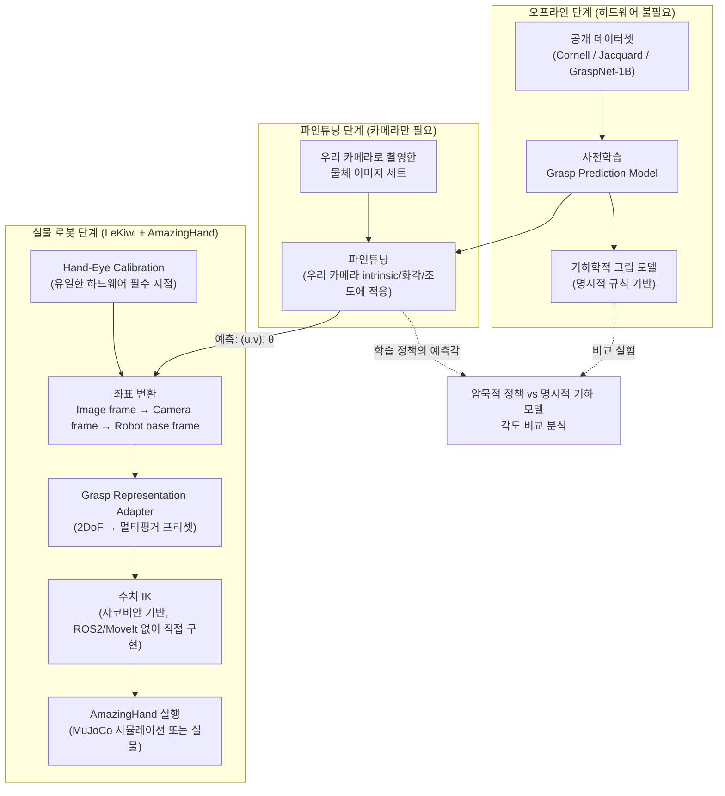
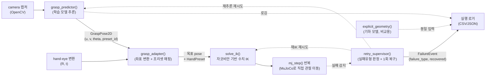

# 그립 각도 자동 탐색 (Automatic Grip Pose Search)

카메라 이미지만으로 "어느 위치를, 어느 회전각으로 접근해야 안정적으로 잡히는가"를 예측하는 모델을 학습시키고,
이를 실제 로봇(LeKiwi + AmazingHand)의 그립 파이프라인에 통합하는 연구.

이 문서는 전체 시스템 구조와 단계별 실행 계획을 정리한다. 핵심 설계 원칙은 하나다:

> **하드웨어 의존점을 최대한 뒤로 미룬다.**
> 이 연구에서 실물 로봇이 반드시 필요한 지점은 **hand-eye calibration** 단 한 곳뿐이다.
> 나머지(사전학습, 파인튜닝용 카메라 데이터 수집, 기하 모델 설계, 비교 실험 설계)는
> 하드웨어 대기 없이 지금 바로 시작할 수 있다.

---

## 1. 연구 배경 요약

| 항목 | 내용 |
|---|---|
| 평행 그리퍼 그립 예측 | 성숙한 분야 (Cornell Grasp, Jacquard, GraspNet-1B 등 벤치마크·베이스라인 다수) |
| 멀티핑거 핸드(AmazingHand) 그립 예측 | 미성숙 — 자유도가 늘어나 표현/탐색 공간이 훨씬 큼 |
| 저가형 하드웨어 기준 연구 사례 | 확인되지 않음 (차별점) |
| 단안 카메라(깊이 센서 無) 그립 예측 | 최근 연구 흐름과 일치 (RGB-only grasp affordance 예측) |
| LeKiwi + 핸드 결합 연구 | 확인되지 않음 (차별점) |
| 저가형 조합의 실패 유형 분류·복구 연구 | 확인되지 않음 — "성공/실패" 이분법을 넘어선 실패 데이터 개념 자체가 부족 |

즉 이 연구는 "단안 카메라 기반 그립 예측"이라는 성숙해가는 방법론을,
"저가형 멀티핑거 핸드 + 모바일 베이스(LeKiwi)"라는 아직 검증되지 않은 조합에 적용하는 것이 핵심 기여다.
여기에 더해, 반복 실행 중 발생하는 실패를 유형별로 분류하고 단순 복구 전략의 효과를 정량화하는 것까지 포함해
"한 번 성공하는 파이프라인"이 아니라 "실패를 설명하고 대응하는 파이프라인"을 지향한다.

---

## 2. 전체 시스템 아키텍처



**단계 구분의 의미**

- **오프라인 단계**: 실물 로봇 없이 GPU만 있으면 진행. 지금 바로 착수 가능.
- **파인튜닝 단계**: 로봇 팔 동작 없이 카메라만 있으면 진행 가능 (물체를 손으로 배치하고 촬영, 또는 teleoperation으로 수집).
- **실물 로봇 단계**: hand-eye calibration이 끝나야 좌표 변환이 의미를 가지므로, 이 시점부터 실제 파지 실행이 가능해짐. 단, F(calibration) 이후의 G~J는 실물 없이 **MuJoCo 시뮬레이션으로도 그대로 실행 가능** — 이 단계 이름이 "실물 로봇 단계"인 건 Hand-Eye Calibration 자체가 실물을 요구하기 때문이지, G~J 전부가 실물을 요구해서가 아니다.

---

## 3. 단계별 실행 계획

### Phase 0 — 사전학습 (Pretraining)
- **입력**: 공개 그립 데이터셋 (RGB 이미지 + 그립 사각형/포인트 라벨)
- **후보 데이터셋**
  - Cornell Grasp Dataset — 소규모, 진입 난이도 낮음, baseline 검증용
  - Jacquard Dataset — 시뮬레이션 대규모, 다양한 물체
  - GraspNet-1Billion — RGB-D, 최신 벤치마크 (깊이 없이 RGB만 사용하는 서브셋으로 활용 가능)
- **출력 표현 (평행 그리퍼 기준, 2DoF)**: `(u, v, θ)` — 이미지 좌표계에서의 중심 위치 + 회전각
- **모델 후보**: GG-CNN 계열(경량, 실시간성 우수) 또는 ResNet/ViT backbone + heatmap regression head
- **산출물**: 사전학습된 가중치, 학습/검증 파이프라인 코드, 재현 가능한 config

### Phase 1 — 파인튜닝 (Domain Adaptation)
- **목적**: 사전학습 도메인(공개 데이터셋 카메라)과 우리 카메라(화각, 해상도, 왜곡, 조도 환경)의 차이 보정
- **데이터 수집**: 우리 카메라로 실제 사용할 물체들을 다양한 각도/거리/조명에서 촬영 (로봇 팔 미동작 상태로도 가능)
- **라벨링 전략**:
  - 소량 수동 라벨링 + 사전학습 모델로 pseudo-label 생성 후 검수 (반자동)
  - 또는 시뮬레이터에서 우리 카메라 intrinsic을 반영한 synthetic fine-tuning set 생성
- **검증 지표**: 사전학습 모델 대비 예측 그립 사각형의 IoU/각도 오차 개선폭

### Phase 2 — Hand-Eye Calibration (유일한 실물 의존 지점)
- **목적**: 카메라 좌표계에서 예측된 `(u, v, θ)` → 카메라 3D 좌표 → 로봇 base 좌표계로 변환하는 변환 행렬 확보
- **방식**: eye-in-hand 또는 eye-to-hand 중 카메라 장착 위치에 맞게 선택 (LeKiwi 구조 확인 필요)
- **도구**: ArUco/Charuco 마커 + MoveIt/TF 기반 calibration 루틴, 또는 `easy_handeye` (ROS) 계열 패키지 활용
- **산출물**: `camera_optical_frame → base_link` 정적 TF, 재보정 스크립트 (진동/재조립 시 재사용)

### Phase 3 — Grasp Representation Adapter (2DoF → AmazingHand)
평행 그리퍼의 2DoF(중심 위치 + 회전각) 표현을 그대로 멀티핑거 핸드에 쓸 수 없다. 손가락 개수만큼 자유도가 늘어나기 때문에, **초기 버전은 단순화 전략을 명시적으로 채택**한다.

- **1단계 (권장 시작점)**: 손가락 배치를 몇 가지 프리셋으로 고정
  - 예: `PINCH`(2지 파지), `TRIPOD`(3지 파지), `WRAP`(전체 감싸기) 등 프리셋 3~5개
  - 모델은 여전히 접근 위치 `(u,v)`와 회전각 `θ`만 예측
  - 프리셋 선택은 규칙 기반(물체 크기/종횡비 추정) 또는 별도의 경량 분류기로 결정
- **2단계 (확장)**: 프리셋 선택 자체도 학습 대상으로 포함 (예측 = 위치 + 각도 + 프리셋 클래스)
- **3단계 (장기)**: 손가락별 관절각까지 직접 회귀하는 완전한 grasp representation으로 확장

이 단계적 접근은 "핸드 그립은 미성숙 분야"라는 연구 배경과 직결된다 — 처음부터 전체 자유도를 학습시키기보다,
평행 그리퍼에서 검증된 2DoF 표현을 최대한 재사용하며 점진적으로 확장하는 것이 리스크를 줄인다.

### Phase 4 — 명시적 기하 모델 (비교군)
- 학습 기반 모델과 별개로, 물체의 point cloud/contour로부터 그립 각도를 **규칙 기반으로 계산**하는 기하 모델을 구현
- 예: 주축(principal axis) 정렬, 최소 폭 방향 탐색, antipodal grasp 조건 검사 등
- 목적: "학습된 정책이 암묵적으로 찾아낸 각도"와 "기하학적으로 계산된 각도"를 정량 비교하는 실험의 기준선(baseline) 확보

### Phase 5 — 비교 실험
- **비교 대상**: (a) 학습 기반 예측 각도, (b) 기하 모델 계산 각도
- **비교 지표**:
  - 각도 차이 (°) 분포
  - 각 방식의 실제 파지 성공률 (실물 로봇 필요)
  - 물체 형상 복잡도에 따른 두 방식의 편차 상관관계 (단순 형상일수록 기하 모델과 일치할 것이라는 가설 검증)
- **의의**: 학습 모델이 실제로 "형상 기반의 합리적인 grasp"를 학습했는지 해석 가능성(interpretability) 관점에서 검증

### Phase 6 — 실패 유형 분류 및 복구 분석
Phase 5의 성공/실패 이분법을 넘어, 반복 실행 중 발생하는 실패를 파이프라인 모듈 단위로 분류하고
단순 복구 전략의 효과를 정량화한다. Phase 5와 같은 trial에서 데이터를 함께 수집하되, 분석 목적이 다르므로
단계는 분리한다.

**분류 체계 (파이프라인 모듈 단위로 정의 → 관찰자가 달라도 같은 분류가 나오도록 판정 기준을 명문화)**

| 실패 유형 | 대응 모듈 | 판정 기준 |
|---|---|---|
| 인식 실패 | Module 01 (grasp model) | 예측 `(u,v,θ)`가 물체 영역 밖이거나, 성공 파지에 필요한 각도와 임계값 이상 벗어남 |
| 계획 실패 | Module 04 (MoveIt) | IK 해 없음 / 충돌로 플래닝 자체가 실패 |
| 궤적 오버슈트 | Module 04 (컨트롤러) | 목표 pose 도달 시 위치·자세 오차가 허용범위 초과 |
| 파지 실패 | Module 02·03 (adapter·핸드) | 접근·플래닝은 성공했으나 물체를 놓치거나 힘 조절 실패 |
| 배치 실패 | 실행 단계 | 파지엔 성공했으나 내려놓는 과정에서 낙하/위치 이탈 |

**시뮬레이션 vs 실물 관찰 가능성**
- 인식 실패·계획 실패 — MuJoCo 시뮬레이션에서도 대부분 재현 가능 → 대량 trial은 시뮬레이션에서 확보
- 궤적 오버슈트·파지 실패 — MuJoCo 접촉 물리로 일부 재현되지만, 저가형 하드웨어의 백래시·마찰은 시뮬레이션이 못 잡음 → 실물 비중 필요
- 배치 실패 — 거의 실물 전용 (무게중심·실제 마찰 계수 의존)

**복구 전략 (1회 재시도, 단순하게 유지 — 정교한 다단계 복구는 범위를 키우므로 지양)**

| 실패 유형 | 복구 전략 |
|---|---|
| 인식 실패 | 카메라 재촬영 → 재추론 |
| 계획 실패 | 모델의 2순위 grasp candidate로 재시도 |
| 궤적 오버슈트 | 접근 속도·게인 낮춰 재시도 |
| 파지 실패 | 접근각 ±10° 조정 후 재시도, 또는 프리셋 변경 |
| 배치 실패 | 배치 속도 낮춰 재시도 |

**비교 지표**
- 조건별(예: 실물 데이터 비중) 실패 유형 분포 변화 — 예: "실물 데이터 비중이 높아지면 인식 실패는 줄지만 파지 실패는 여전하다"
- 복구 전/후 성공률 차이 (유형별 + 전체)

**의의**: 사전에 예측한 실패 원인(calibration 오차 누적, 저가형 하드웨어 반복 정밀도 한계 등)을 실측으로 검증하고,
가장 저비용인 복구 전략만으로 성공률을 얼마나 끌어올릴 수 있는지 정량화한다.
"예측 → 실측 → 대응 → 검증"으로 이어지는 완결된 사이클을 만드는 단계다.

---

## 4. MuJoCo 파이프라인 설계 (통합 시점)

**ROS2 없이, 파이썬 함수 체인 + MuJoCo Python API만으로 구성한다.** 실물 로봇이 오기 전 단계에서는
분산 노드·실시간 통신 같은 ROS2의 강점이 아직 필요 없고, 오히려 설치·디버깅 부담만 늘어난다.
나중에 실물 배포 단계에서 ROS2가 필요해지면, 아래 함수들을 그대로 ROS2 노드로 감싸기만 하면 되므로
지금 짜는 로직은 버려지지 않는다.



**ROS2 버전과의 대응 관계 (뭘 무엇으로 바꿨는지)**

| ROS2 버전 | MuJoCo-only 버전 | 잃는 것 |
|---|---|---|
| `grasp_predictor_node` / `grasp_adapter_node` | 그냥 파이썬 함수 (`grasp_adapter_demo.py`에 이미 있음) | 없음 — pub/sub이 함수 호출로 바뀔 뿐 |
| `GraspPose2D.msg` | Python dataclass (같은 필드) | 없음 |
| MoveIt2 `move_group` (경로 계획) | 직접 구현하는 자코비안 기반 수치 IK (`mj_jac()` 활용, damped least squares) | **충돌 회피 경로 계획** — 지금 시나리오(테이블 위 물체 하나 집기)엔 큰 문제 아님 |
| `amazinghand_controller` (FollowJointTrajectory) | 목표 관절각을 MuJoCo position actuator에 넣고 `mj_step()` 반복 | 없음 — 실시간성이 필요 없는 오프라인 검증이라 무관 |
| `rosbag2` | CSV/JSON 로거 | 없음 — 재생(replay) 기능은 없지만 분석엔 충분 |
| URDF/SRDF, `mujoco_ros2_control` | 이미 만든 MJCF(`so101_amazinghand_scene.xml`)를 그대로 사용 | 없음 |

- **retry_supervisor()** (Phase 6): 실행 실패를 감지해 인식/계획/궤적 오버슈트/파지/배치 5가지 유형으로 분류하고, 유형별 1회 복구 전략을 실행. `FailureEvent` 레코드(`failure_type, phase, retry_count, recovered`)로 로깅
- **CSV/JSON 로깅**: Phase 5 비교 실험과 Phase 6 실패 분석을 위해 추론 결과/기하 모델 결과/실제 실행 결과/`failure_type`을 항상 함께 기록

---

## 5. 제안 리포지토리 구조

```
first-repository/
├── docs/
│   └── grip-angle-auto-search.md        # 본 문서
├── grasp_model/                          # Phase 0~1: 모델 학습 (ROS 비의존)
│   ├── datasets/                         # Cornell/Jacquard 로더, 우리 카메라 데이터 로더
│   ├── models/                           # backbone + grasp head 정의
│   ├── train_pretrain.py
│   ├── train_finetune.py
│   └── configs/
├── geometry_baseline/                    # Phase 4: 명시적 기하 모델 (ROS 비의존)
│   └── explicit_grasp_geometry.py
├── grasp_adapter/                        # Phase 2~4: MuJoCo 기반 파이프라인 (ROS2 비의존)
│   ├── mujoco_model/                     # SO-101 + AmazingHand 결합 MJCF (완성)
│   ├── hand_eye_solve.py                 # Phase 2: 터치 좌표 -> (R, t) 계산 (완성)
│   ├── grasp_adapter_demo.py             # Phase 3: 좌표 변환 + 프리셋 매핑 (완성)
│   ├── ik_solver.py                      # Phase 4: 자코비안 기반 수치 IK
│   ├── retry_supervisor.py               # Phase 6: 실패 유형 판정 + 1회 복구 전략
│   └── run_pipeline.py                   # Phase 4: 전체 파이프라인 실행 진입점
└── experiments/
    ├── compare_implicit_vs_explicit/     # Phase 5: 비교 실험 스크립트/결과
    └── failure_taxonomy/                 # Phase 6: 실패 유형 분포·복구 전후 성공률 분석
```

---

## 6. 로드맵 (하드웨어 의존성 명시)

| 단계 | 필요 자원 | 착수 가능 시점 |
|---|---|---|
| Phase 0 사전학습 | GPU, 공개 데이터셋 | **즉시** |
| Phase 4 기하 모델 설계 | 없음 (알고리즘 설계) | **즉시** |
| Phase 1 파인튜닝 데이터 수집 | 카메라 (로봇 팔 불필요) | **즉시** |
| Phase 1 파인튜닝 학습 | GPU, 위 데이터 | Phase 0 완료 후 |
| Phase 2 Hand-eye calibration | LeKiwi + 카메라 (실물) | **하드웨어 도착 후** |
| Phase 3 Grasp adapter 구현 | AmazingHand 사양 문서 | 하드웨어 도착 전 설계 가능, 실측 검증은 도착 후 — **완료, `grasp_adapter_demo.py`** |
| MuJoCo 파이프라인 통합 (Phase 2~4 연결) | 없음 — MuJoCo만 있으면 됨 | **하드웨어 무관, 즉시 가능** |
| Phase 5 비교 실험 | MuJoCo(대량) + 실물 로봇(소량 검증) | 파이프라인 통합 완료 후 |
| Phase 6 실패 분류 및 복구 분석 | MuJoCo(대량) + 실물 로봇(소량 검증) | Phase 4~5와 병행 |

**결론**: ROS2를 빼면서 하드웨어 의존점이 하나 더 줄었다 — 이제 **Phase 2(hand-eye calibration)만 실물이 꼭 필요**하고,
나머지(Phase 0/1/3/4 설계, MuJoCo 파이프라인 통합, Phase 5/6의 대량 trial)는 전부 MuJoCo만으로 지금 진행할 수 있다.
실물 하드웨어는 ① hand-eye calibration 실측, ② 시뮬레이션 결과를 검증하는 소규모 실물 trial, 이 두 지점에만 필요하다.
Phase 2 → MuJoCo 파이프라인 통합 → Phase 5(비교 실험) → Phase 6(실패 분류·복구 분석) 순으로 진행하되,
Phase 2를 뺀 나머지는 실물 도착 전에 대부분 끝내두는 게 목표다.

---

## 7. 다음 학습 포인트

이 프로젝트를 진행하면서 익혀두면 좋은 개념들을 실행 순서에 맞춰 정리한다. ROS2를 빼기로 하면서
일부는 "실물 배포 단계에서 필요해지면"으로 미뤘다.

1. **좌표 변환 수학** — `camera_optical_frame → base_link` 변환을 행렬 연산으로 직접 구현하는 법 (`hand_eye_solve.py`로 이미 실습함). ROS2의 `tf2_ros`가 자동으로 해주는 걸 지금은 직접 짠 것.
2. **hand-eye calibration 수학**: `AX = XB` 문제의 의미, eye-in-hand vs eye-to-hand 차이 — 완료
3. **자코비안 기반 수치 IK**: 자코비안 행렬이 뭔지, damped least squares로 목표 pose에 도달하는 관절각을 푸는 법, 특이점(singularity) 근처에서 왜 불안정해지는지 — MoveIt2가 내부적으로 하던 일을 직접 구현
4. **MuJoCo 액추에이터 제어**: position actuator에 목표값을 주고 `mj_step()`을 반복해서 실제로 관절이 움직이게 하는 법
5. *(나중에, 실물 배포 단계)* **MoveIt2 motion planning**과 **ROS2 커스텀 메시지/노드 설계**: 지금 만든 함수 체인을 ROS2 노드로 감쌀 때 필요. 지금 당장은 몰라도 프로젝트 진행에 지장 없음

필요하면 이 중 아무 항목이나 골라서 더 깊이 들어가도 좋다 — 예를 들어 자코비안 기반 IK를 직접 유도해볼 수도 있고,
MuJoCo의 `mj_jac()` 함수가 내부적으로 뭘 계산하는지부터 뜯어볼 수도 있다.
