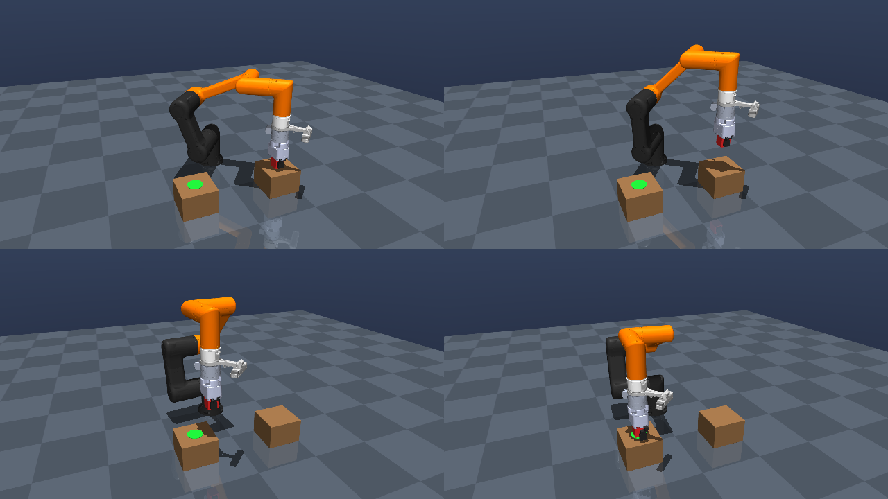

# HCR-3A MuJoCo Pick & Place



Full video: [`media/pick_place.mp4`](media/pick_place.mp4)

## Files

| File | Description |
|------|-------------|
| `hcr3a_mujoco.xml`, `hcr3a.urdf`, `meshes/` | Original HCR-3A MJCF/URDF package |
| `scene.xml` | Pick-and-place scene: robot + 2 tables + 4 cm cube + actuators |
| `pick_place.py` | IK-based pick-and-place controller |

## Run

```bash
pip install mujoco imageio imageio-ffmpeg

# Interactive viewer (on a machine with a display)
python pick_place.py

# Headless, save an mp4 (on a server without a GPU: MUJOCO_GL=osmesa)
python pick_place.py --video media/pick_place.mp4
```

## Changes to the original model (in `scene.xml`)

- **Actuators**: the original MJCF has none, so position actuators were added for the 6 joints and 2 fingers.
- **Gravity compensation**: `gravcomp="1"` on the robot bodies.
- **Collisions**: the robot mesh geoms are visual only (`contype=0`). The finger meshes are concave, and their convex hulls would block the gap between the fingers, so a box pad (`pad1`, `pad2`) was added to each fingertip for grasping.
- **TCP site**: `tcp`, 0.214 m along the tool axis from `link_6`, between the fingertips.

## How it works

1. The TCP path moves through: approach → descend → grip → lift → transfer → lower → release → retreat.
2. Every control step, damped least-squares IK computes the joint targets for a position plus a fixed top-down gripper orientation.
3. The joint targets are sent to the position actuators. The gripper closes past the contact point, and the actuators' force limit sets how hard it squeezes the cube.

With a top-down grasp, the reach at 0.22 m height is about 0.33 m, so the tables are at (0.32, ±0.18).
