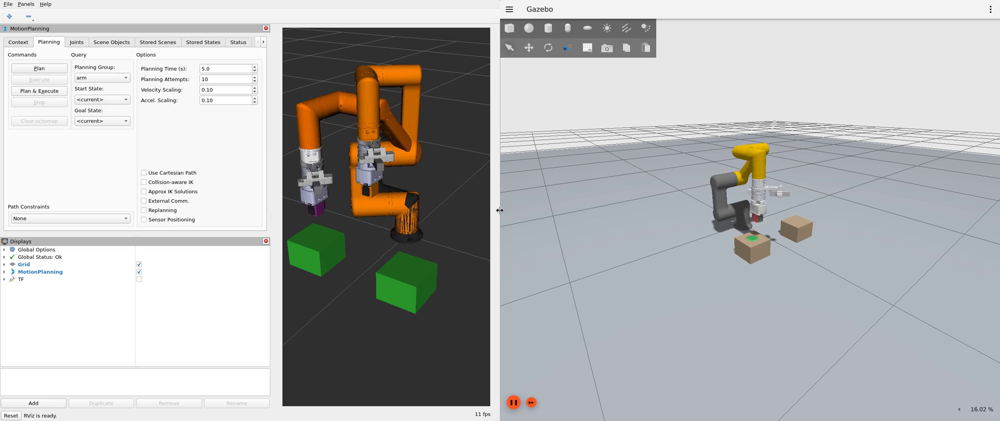

# HCR-3A ROS 2 (Humble) — MoveIt 2 + RViz 2 + Gazebo pick & place



Video (2x speed): [`media/gazebo_moveit_pick_place.mp4`](media/gazebo_moveit_pick_place.mp4) — RViz (MoveIt) on the left, Gazebo on the right.

## Packages

| Package | Contents |
|---------|----------|
| `hcr3a_description` | URDF/xacro (from the vendor `hcr3a.urdf`), meshes, ros2_control tags (mock or Gazebo) |
| `hcr3a_moveit_config` | SRDF (`arm`, `gripper` groups, `home`/`open`/`close` states), KDL kinematics, OMPL, controllers, RViz config, launch files |
| `hcr3a_gazebo` | Gazebo Fortress world (two tables + 4 cm cube, same layout as the MuJoCo demo) and the full bringup launch |
| `hcr3a_pick_place` | C++ `MoveGroupInterface` node: home → above cube → down → grasp → up → above target → down → release → up → home |

## Requirements

Ubuntu 22.04 + ROS 2 Humble + Gazebo Fortress.

```bash
sudo apt install ros-humble-desktop ros-humble-moveit ros-humble-ros2-control \
  ros-humble-ros2-controllers ros-humble-ros-gz ros-humble-ign-ros2-control \
  ros-humble-xacro ros-humble-joint-state-publisher-gui
```

## Build

```bash
cd ros2_ws
source /opt/ros/humble/setup.bash
rosdep install --from-paths src --ignore-src -y   # optional, installs anything missing
colcon build --symlink-install
source install/setup.bash
```

## Run

**1. Gazebo + MoveIt + RViz, then the pick-and-place node**

```bash
# terminal 1
ros2 launch hcr3a_gazebo sim.launch.py
# terminal 2 (once the controllers are active)
ros2 launch hcr3a_pick_place pick_place.launch.py
```

`sim.launch.py headless:=true rviz:=false` runs Gazebo without GUIs.

**2. MoveIt + RViz only (mock hardware, no physics)**

```bash
ros2 launch hcr3a_moveit_config demo.launch.py
ros2 launch hcr3a_pick_place pick_place.launch.py use_sim_time:=false
```

Drag the interactive marker in RViz and use **Plan & Execute** to move the arm by hand.

**3. URDF only**

```bash
ros2 launch hcr3a_description view_robot.launch.py
```

## Notes

- **Frames**: `tcp` is a frame between the fingertips, 0.214 m from `link_6`, with z along the approach direction. The node commands top-down grasps (tcp z pointing down, fingers closing along world x).
- **Gripper**: `finger1` closes in +, `finger2` closes in −. `open` = ∓0.02. `close` = ±0.01, which is 4.5 mm past contact with the 4 cm cube. The fingers stall on the cube and the 20 N joint effort limit sets the grip force. The finger collisions are fingertip boxes, because the concave finger meshes would otherwise close the gap between the fingers.
- **Reach**: with a top-down gripper the tcp reaches about 0.33 m at 0.22 m height, so the tables sit at (0.32, ±0.18). The cube and target positions are node parameters (`cube_x`, `cube_y`, `place_x`, `place_y`, …).
- **IK**: pose goals are solved by KDL, seeded from the current state, so the arm stays on one IK branch. Straight-line moves use `computeCartesianPath` with jump detection.
- **Self-collision**: the SRDF disables adjacent links and the rigid tool stack. The other pairs were checked by sampling 400 random states with MoveIt's `/check_state_validity`; only `camera_Link`/`camera_link` always collide.
- **Tested** headless with ROS 2 Humble (RoboStack), Gazebo Fortress, MoveIt 2 and ign_ros2_control. Two Gazebo runs placed the cube within 4–5 mm of the target.
- **Real hardware**: replace the `ros2_control` hardware plugin in `hcr3a_description/urdf/hcr3a.ros2_control.xacro` with a driver for the HCR controller. The MoveIt config and the pick-and-place node stay the same.
